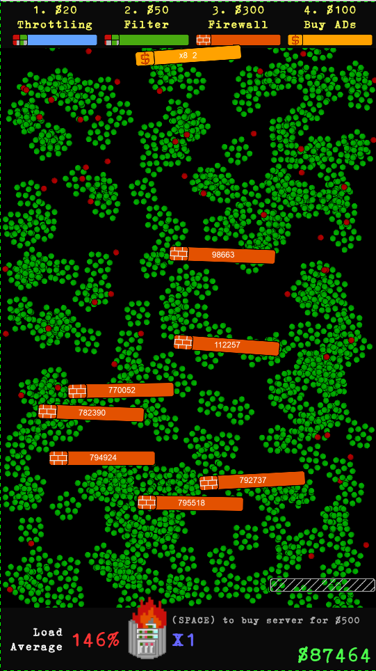
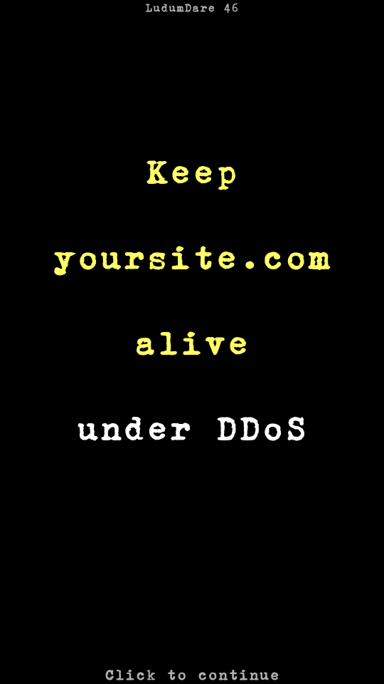
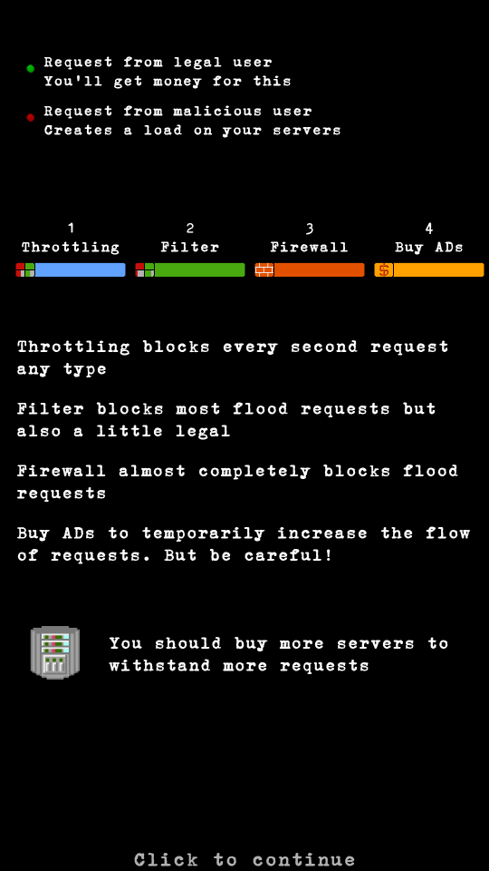

# LudumDare46
Моя игра для [LudumDare 46](https://ldjam.com/events/ludum-dare/46/ddos-is-coming) с темой "Keep it alive".

В непростых условиях постоянных DDoS так нужно развить свой маленький web сервис, 
наращивая число серверв и сумму на счету. 

Есть три инструмента защиты от атак, а так же возможность покупать новые сервера и закупаться рекламой.

Приходится балансировать между вложениями в защиту, закупками новых серверов и их перегревом.
Если сервера не справятся с нагрузкой, то они просто сгорят, и наступит Game Over. 

От придумывания идеи до текущего варианта ушло где-то 29 часов разработки. 

CoronaSDK + Aseprite.

[gameplay video](https://www.youtube.com/watch?v=ElEPUS7UlKA)

